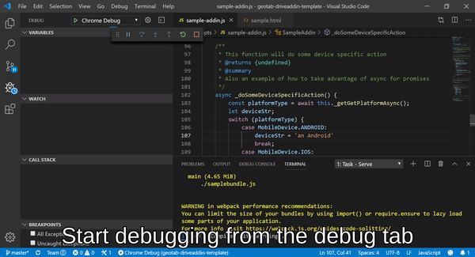

# Geotab Drive Addin Template
This is a template that can be used to create Geotab Drive add-ins.  For information about Geotab Drive add-ons refer to here:
[Geotab - Developing Addins](https://geotab.github.io/sdk/software/guides/developing-addins/)

## About This Template
This template builds upon the template currently available in Yeoman, but utilizes WebPack in conjunction with the latest available versions (a/o 10/2019) of Gulp and Babel.

Typescript support can easily be added by modifying the webpack config and uncommenting the typescript support section.

## VSCode
This template can be used in numerous IDE's, but there is built-in support for VSCode debugging in conjunction with the Chrome Debugger extension via the ./vscode files.  Debugging is as simple as running the "gulp" command and then hitting F5 with full support for adding breakpoints in your code and stepping through logic.

